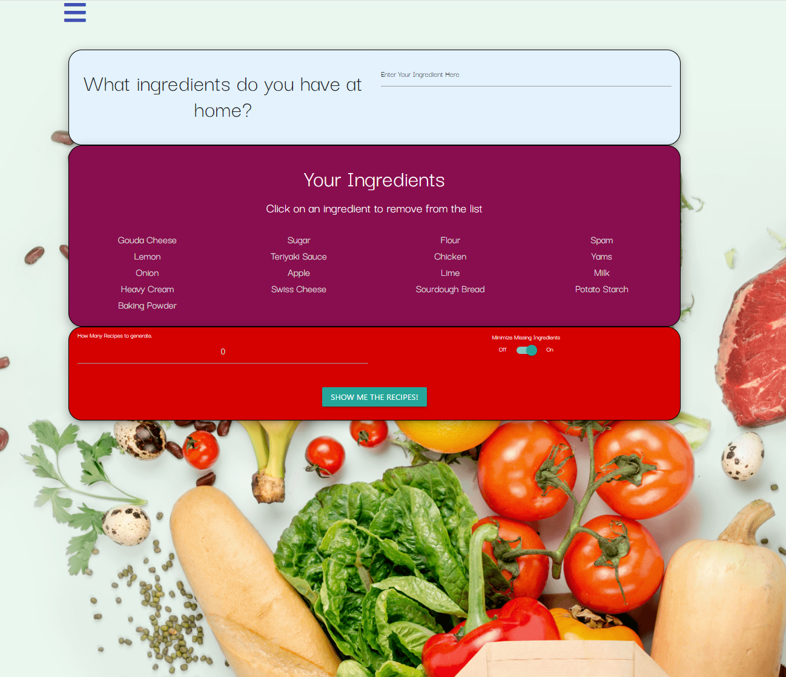
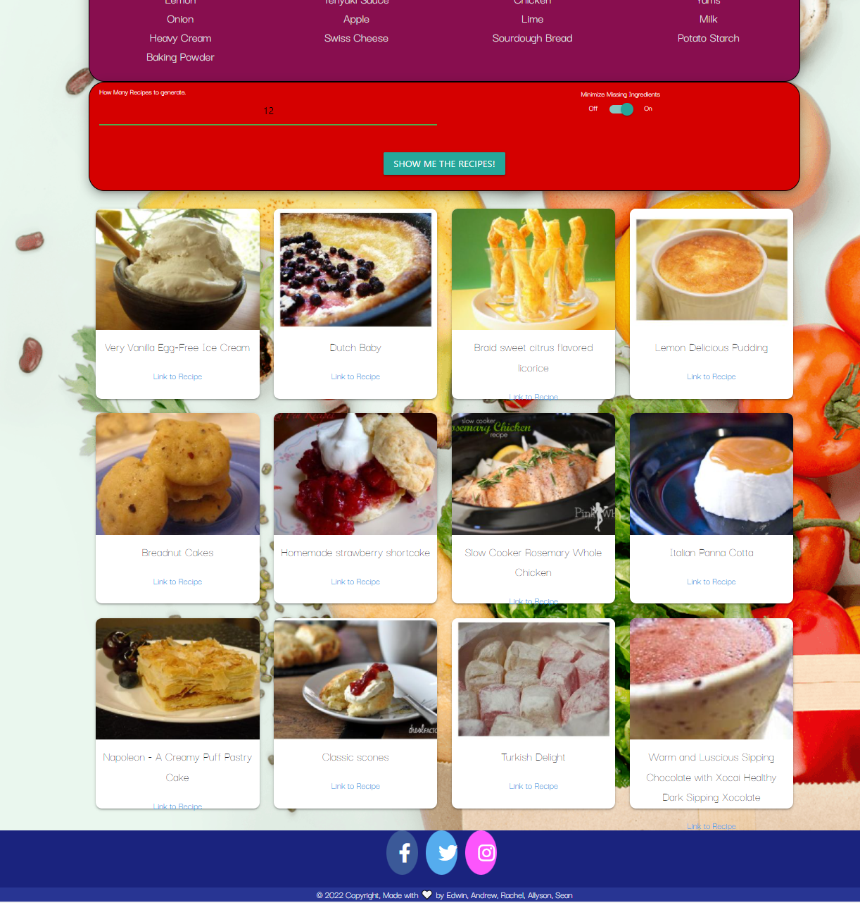
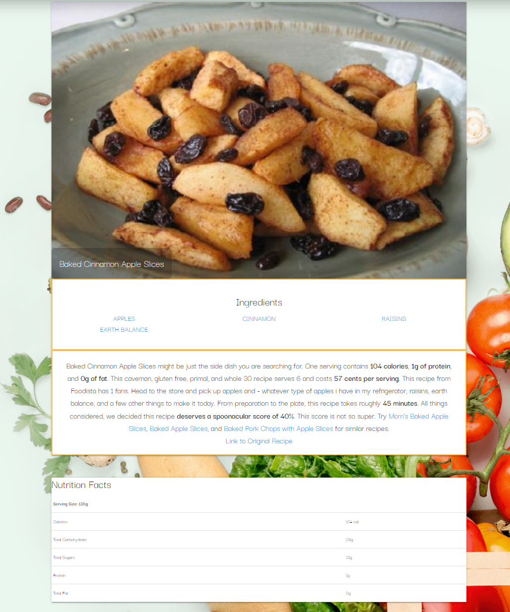

# Ingredient-to-Meal-Planner

## About
This app will help the user decide on a meal to cook and prepare based on the ingredients on hand! The user can save ingredients that they own on an ingredient list and use the app to generate recipes based on those ingredients. The app will search a large database of recipes and return the requested amount of recipes to the user. They can even sort the recipes to show recipes that are missing the least amount of ingredients first!

Access this useful app at: https://famesmyname.github.io/Ingredient-to-Meal-Planner/

## Instructions

### Home Page

The home screen is shown below:



- In the top area, enter the ingredients you own and the items will be added to the list of ingredients in the section below.
- In the ingredients section, you can click on any ingredients listed to remove the item from the list. This list is saved for the user.
- In the following section, you may enter the amount of recipes you would like shown to you, along with a switch allowing you to pick if you want items that need the least extra ingredients first.
- When you are ready to search, hit the "Show me the Recipes!" button to generate recipes based on you choices and ingredients owned.




- The recipe cards will show the name of the recipe and have a link to the recipe information.
- Clicking on the card picture will bring up a slide in display showing how many ingredients that the recipe have missing from your ingredients list.
- Clicking on the link will take the user to a new page with specific information about the recipe.


### Recipe Page

- For the recipe page, the recipe and image are show at the top of the page.
- Underneath is the ingredients list with link to Amazon to purchse the ingredients if needed.
- The links help monetize the page as we (Ingredient2MealARESA on Amazon) get a portion of the procedes if a purchase is made.
- At the bottom of the page is the nutritional facts for the recipe chosen.




## Created Using
```
HTML
CSS
JavaScript
MATERIALIZE
Spoonacular API
Amazon.com

``

## Credits

Allyson Vitug
Rachel Marron
Andrew Ngo
Edwin Fame
Sean Lee